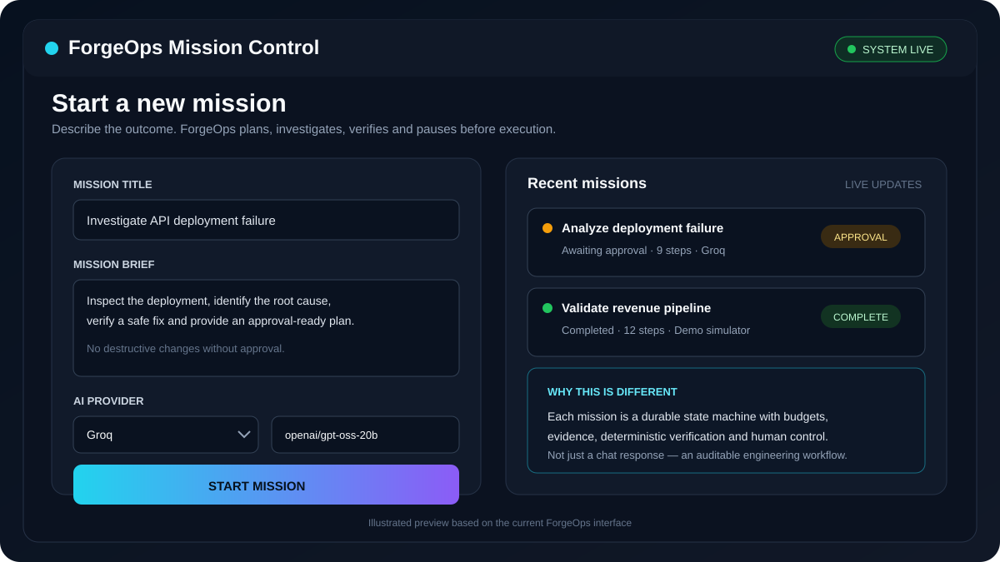
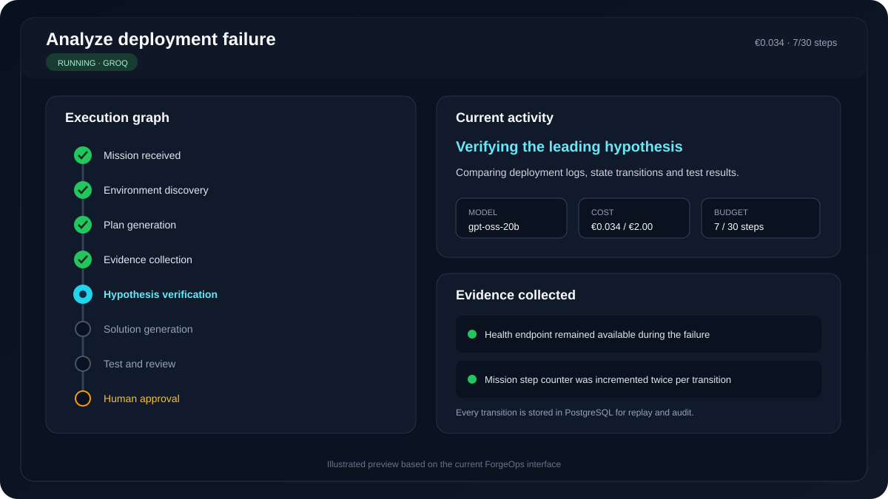
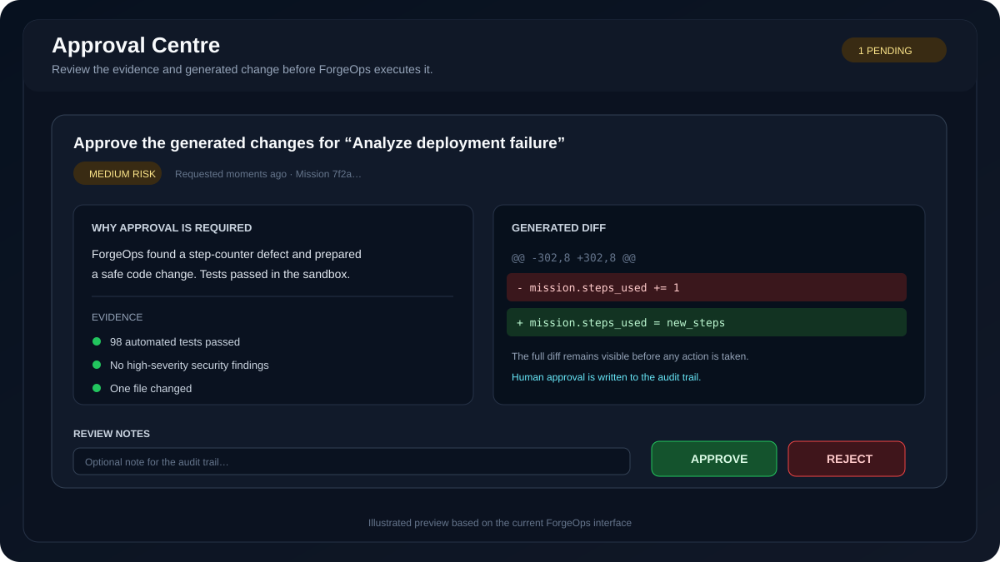

<div align="center">

# ⚙️ ForgeOps AI

### An approval-controlled AI engineer for software, data and cloud incidents

**Investigate → collect evidence → identify root cause → verify a fix → request human approval**

[](https://github.com/chanderbhanu096/forgeops/actions/workflows/ci-cd.yml)
[](https://python.org)
[](https://fastapi.tiangolo.com)
[](https://nextjs.org)
[](https://postgresql.org)

[**Open the live demo**](https://forgeops-staging-web.greenrock-70958585.northeurope.azurecontainerapps.io) · [Start locally](#start-in-60-seconds) · [Add an LLM](#add-an-llm-provider) · [Architecture](#architecture)

</div>

---

## What a recruiter can see in two minutes

Click **Run the guided demo** in the live application. No API key is needed.

The demo investigates a checkout API that returns a healthy status while real checkout requests fail. ForgeOps produces a visible report containing:

- The environment and services analyzed
- A four-step investigation plan
- Exact evidence with file and log references
- Three ranked root-cause hypotheses
- A 94% confidence conclusion
- A minimal one-file configuration patch
- Three regression tests
- Security and operational risks
- Simulated post-deployment metrics

### Example conclusion produced by the demo

> **Root cause:** the PostgreSQL connection pool is limited to five connections with no overflow. Checkout requests time out under concurrency, while the health endpoint stays green because it never opens a database connection.

**Evidence shown in the UI:**

```text
checkout-api.log:184-190 — QueuePool timeout during checkout
database.py:12          — pool_size=5, max_overflow=0
health.py:8-14          — health check bypasses PostgreSQL
```

**Verified outcome:**

```text
25 concurrent checkout requests: 25 passed
Database reconnection test: passed
p95 checkout latency: 31.2s → 420ms
Confidence: 94%
```

---

## Product walkthrough

These working interface previews remain in the repository so the README never contains broken images. The deployment also runs Playwright to capture real PNG screenshots into `docs/images/live/` after a successful release.

### 1. Create a mission and choose the model



### 2. Follow the durable execution graph



### 3. Review the evidence before approval



---

## Why this is not another chatbot

A normal chatbot returns text. ForgeOps demonstrates the engineering systems around an AI worker:

- Durable state machine with PostgreSQL checkpoints
- Per-mission provider and model selection
- Evidence retrieval and ranked hypotheses
- Deterministic code, SQL and infrastructure verification
- Multi-agent builder, reviewer, security and judge roles
- Step, cost and time budgets
- Human approval before execution
- Persistent audit history and operational memory
- REST APIs, server-sent events and Prometheus metrics
- Docker, GitHub Actions and Azure Container Apps deployment

---

# Start in 60 seconds

You only need **Git** and **Docker Desktop**.

```bash
git clone https://github.com/chanderbhanu096/forgeops.git
cd forgeops
```

Create your private environment file:

**macOS/Linux**

```bash
cp .env.example .env
```

**Windows PowerShell**

```powershell
Copy-Item .env.example .env
```

Start everything:

```bash
docker compose up --build
```

Open:

```text
http://localhost:3000
```

Click **Run the guided demo**, then **Launch and view progress**. ForgeOps opens the result page automatically.

### Useful local addresses

| Address | Purpose |
|---|---|
| `http://localhost:3000` | Mission Control |
| `http://localhost:8000/docs` | Interactive API documentation |
| `http://localhost:8000/health` | API health check |
| `http://localhost:8000/metrics` | Prometheus metrics |

Stop the stack:

```bash
docker compose down
```

Reset all local data:

```bash
docker compose down -v
```

---

# Add an LLM provider

Demo mode works without a key. To use a real model, edit `.env`, add one provider, and restart Docker.

## Groq

```dotenv
GROQ_API_KEY=gsk_your_key_here
DEFAULT_LLM_PROVIDER=groq
DEFAULT_LLM_MODEL=openai/gpt-oss-20b
```

## OpenAI

```dotenv
OPENAI_API_KEY=sk_your_key_here
DEFAULT_LLM_PROVIDER=openai
DEFAULT_LLM_MODEL=gpt-5-mini
```

## Anthropic / Claude

```dotenv
ANTHROPIC_API_KEY=sk-ant-your_key_here
DEFAULT_LLM_PROVIDER=anthropic
DEFAULT_LLM_MODEL=claude-sonnet-4-20250514
```

## OpenRouter

```dotenv
OPENROUTER_API_KEY=sk-or-your_key_here
DEFAULT_LLM_PROVIDER=openrouter
DEFAULT_LLM_MODEL=openrouter/auto
```

## Ollama

```dotenv
OLLAMA_BASE_URL=http://host.docker.internal:11434
DEFAULT_LLM_PROVIDER=ollama
DEFAULT_LLM_MODEL=llama3.2
```

Restart after editing `.env`:

```bash
docker compose down
docker compose up --build
```

Check provider availability:

```bash
curl http://localhost:3000/api/backend/api/v1/models
```

Your provider should show:

```json
"configured": true
```

API keys stay on the server. They are never returned to the browser or stored in mission records.

More options: [docs/MODEL_PROVIDERS.md](docs/MODEL_PROVIDERS.md)

---

# How the approval workflow works

Real-provider missions stop before execution.

1. Open the mission result.
2. Review the root cause, evidence, confidence, patch and risks.
3. Open **Approval Centre**.
4. Approve to continue or reject to stop.
5. The decision and reviewer notes are saved in PostgreSQL.

Demo mode automatically continues so a recruiter can see the entire lifecycle without credentials.

---

# Architecture

```text
┌─────────────────────────────────────────────────────────────┐
│                     Mission Control UI                      │
│ mission form · live graph · analysis report · approval      │
└────────────────────────────┬────────────────────────────────┘
                             │ REST + SSE
┌────────────────────────────▼────────────────────────────────┐
│                         FastAPI API                         │
│ missions · approvals · models · skills · memory · metrics   │
└────────────────────────────┬────────────────────────────────┘
                             │
┌────────────────────────────▼────────────────────────────────┐
│                  Durable Agent Runtime                      │
│ checkpoints · budgets · pause/resume · audit transitions    │
└───────────────┬──────────────────────────────┬──────────────┘
                │                              │
┌───────────────▼──────────────┐  ┌────────────▼──────────────┐
│        Model Gateway         │  │ Retrieval + Verification  │
│ OpenAI · Claude · Groq       │  │ evidence · ranking · tests│
│ OpenRouter · Ollama · custom │  │ security · sandbox · judge│
└──────────────────────────────┘  └───────────────────────────┘
                │                              │
┌───────────────▼──────────────────────────────▼──────────────┐
│             PostgreSQL · Redis · observability             │
└─────────────────────────────────────────────────────────────┘
```

---

# Test the backend

```bash
docker compose run --rm api poetry run pytest tests/ -v
```

The CI workflow runs linting and the complete backend test suite before it builds or deploys images.

---

# Current scope

ForgeOps is a portfolio-grade engineering platform and reference implementation. The demo scenario is deterministic and clearly labelled; it does not pretend to inspect a real production system. Real repository, cloud and data-platform access requires explicit credentials and hardened connectors.

## License

[MIT](LICENSE)
